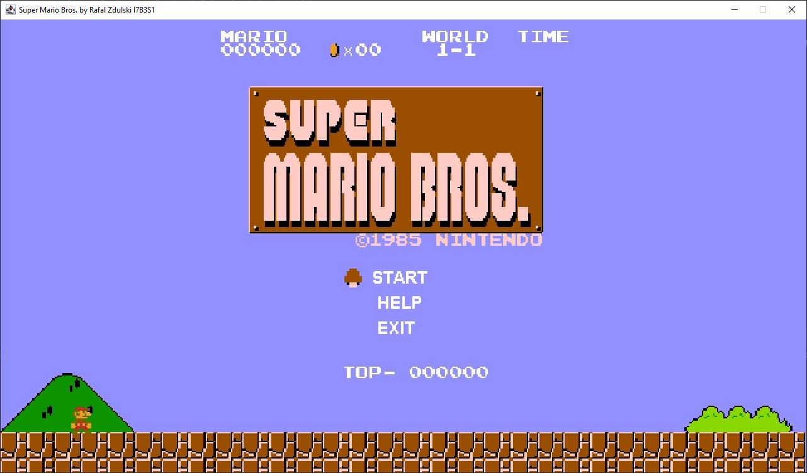
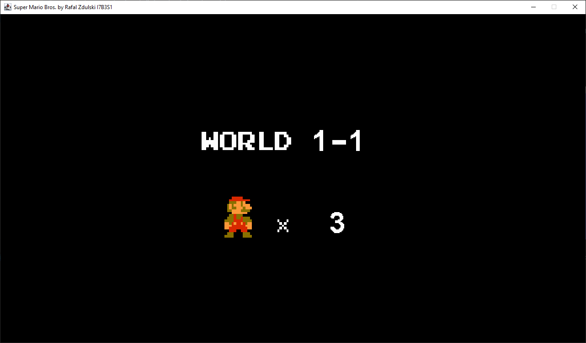
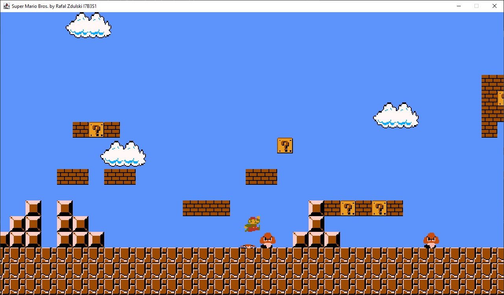
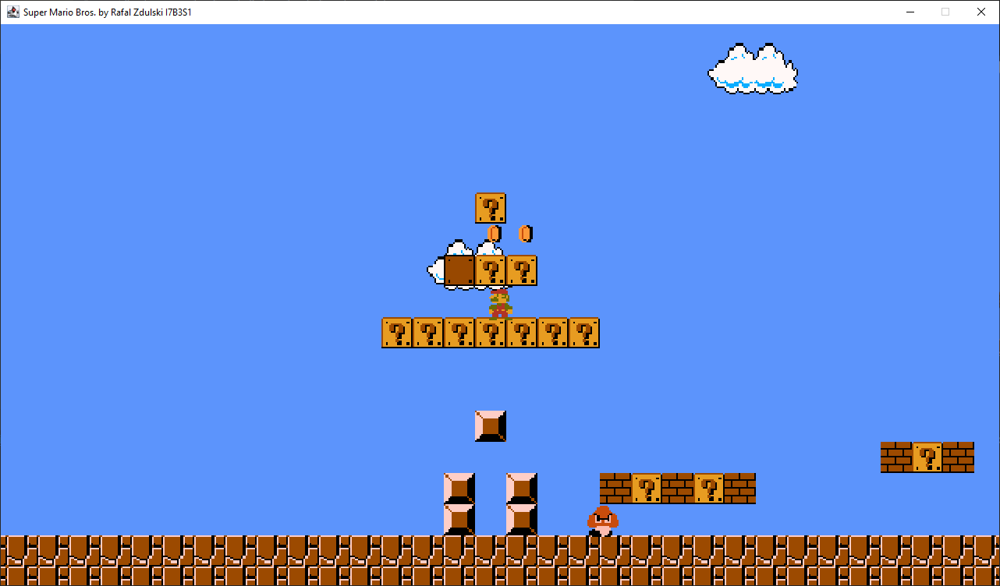
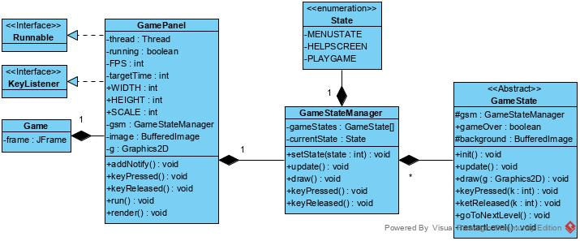
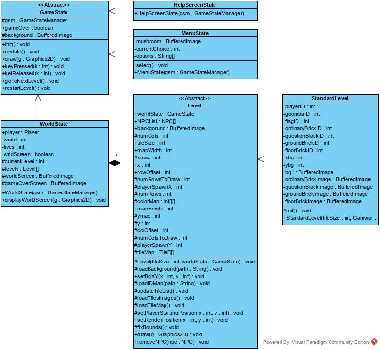
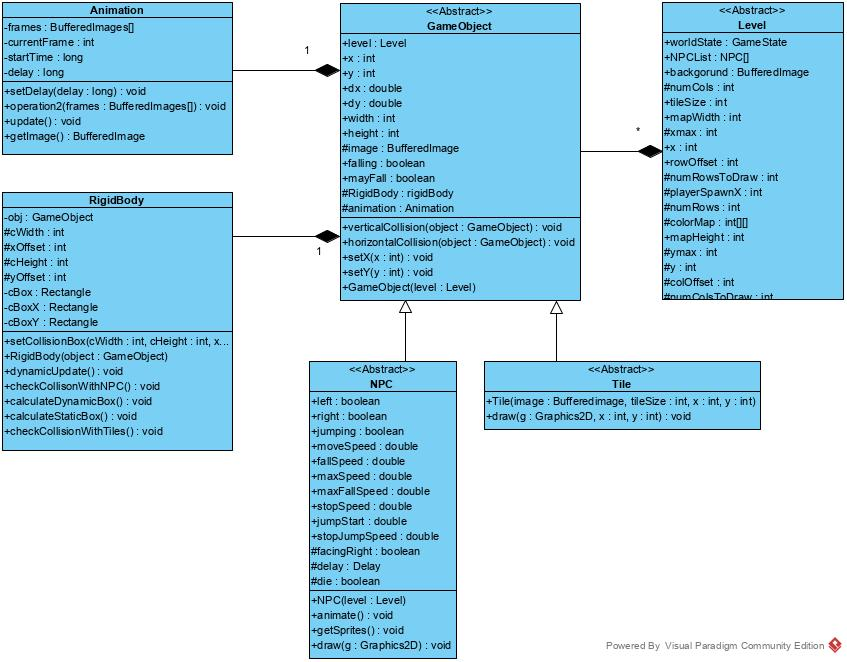
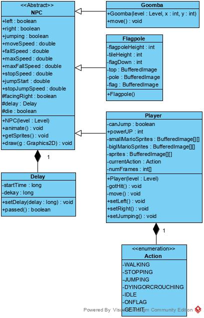
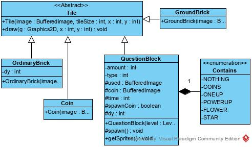
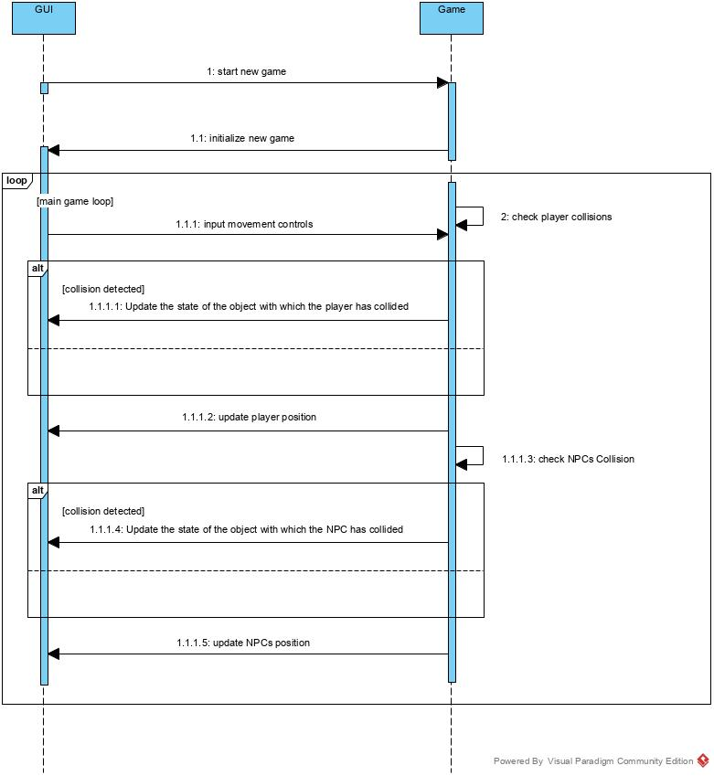

# Super Mario Java Swing
Java Swing application. loosely mimics Super Mario bros. 
Contains only first 2 level of first world.
It's simple project made fir school project back in 2019.

## Screenshots

## Diagrams

